# Feuille de Route Stratégique du Projet Pifpaf

## 1. Introduction
Ce document présente la stratégie de développement du projet Pifpaf. L'objectif est de construire une marketplace de haute qualité de manière itérative.

Initialement organisé en **Sprints thématiques** séquentiels, le développement a évolué vers une approche plus organique, où les fonctionnalités ont été implémentées en fonction des opportunités et des dépendances techniques plutôt qu'un calendrier strict. **Ce document a été mis à jour pour refléter l'état actuel du projet.** Il sert désormais de carte globale des fonctionnalités (achevées et restantes) plutôt que d'un plan chronologique.

La priorisation et l'organisation des tâches sont basées sur un **arbre de dépendances technologiques** qui garantit que les fonctionnalités sont développées dans un ordre logique.

> **Décision Stratégique (Novembre 2025) :** Le prochain cycle de développement sera entièrement consacré à la mise en place du **Thème 13 : Notifications**. Un système de notification robuste est considéré comme un prérequis fondamental pour améliorer l'expérience utilisateur sur l'ensemble des autres thèmes (transactions, messagerie, etc.).

## 2. L'Arbre Technologique & Les Lignes de Développement
Notre stratégie est visualisée par l'arbre ci-dessous. Il montre les dépendances entre les fonctionnalités et leur état d'avancement. **Les fonctionnalités terminées sont sur fond vert.**

```mermaid
graph LR
    %% === Fondations (Acquis) ===
    subgraph " "
        direction LR
        subgraph Fondations
            direction TB
            F_Auth["Auth & Profils"]
            F_Annonces["CRUD Annonces"]
            F_Achat["Parcours Achat Simple"]
            F_Paiement["Paiement & Portefeuille"]
            F_Logistique["Logistique de base"]
        end
    end

    %% === Thème: Vendeur Augmenté ===
    subgraph "Thème: Vendeur Augmenté"
        direction TB
        subgraph " "
            S3_ANN1["US-ANN-1: Uploader images"] --> S3_ANN2["US-ANN-2: Définir principale"] --> S3_ANN3["US-ANN-3: Gérer galerie"]
            S3_IA1["US-IA-1: Analyse IA"] --> S3_IA2["US-IA-2: Valider suggestions"]
            S3_ANN5["US-ANN-5: Dépublier"] --> S3_ANN6["US-ANN-6: Republier"]
            S3_ANN7["US-ANN-7: Indiquer 'Vendu'"]
        end
    end

    %% === Thème: Logistique Avancée ===
    subgraph "Thème: Logistique Avancée"
        direction TB
        subgraph " "
            S4_LOG1["US-LOG-1: Gérer adresses retrait"] --> S4_LOG2["US-LOG-2: Activer options / annonce"]
            S4_LOG3["US-LOG-3: Voir modes livraison"] --> S4_LOG4["US-LOG-4: Choisir mode à l'offre"] --> S4_LOG5["US-LOG-5: Gérer adresses livraison"]
            S4_TRS2["US-TRS-2: Voir identité acheteur"]
            S4_LOG8["US-LOG-8: Filtrer par distance"]
        end
    end

    %% === Thème: Finalisation & Historique ===
    subgraph "Thème: Finalisation & Historique"
        direction TB
        subgraph " "
            S5_LOG6["US-LOG-6: Ajouter code suivi"] --> S5_LOG7["US-LOG-7: Voir code suivi"]
            S5_HIS1["US-HIS-1: Page Mes Achats/Ventes"] --> S5_HIS3["US-HIS-3: Détail transaction"]
            S5_TRS1["US-TRS-1: Payer avec solde"]
            S5_HIS4["US-HIS-4: Historique portefeuille"]
            CHK1["US-CHK-1: Accéder au récap"] --> CHK2["US-CHK-2: Valider récap"] --> CHK3["US-CHK-3: Voir confirmation"]
        end
    end

    %% === Thème: Communauté & IA v2 ===
    subgraph "Thème: Communauté & IA v2"
        direction TB
        subgraph " "
            S6_COM1["US-COM-1: Noter transaction"] --> S6_COM2["US-COM-2: Voir notes profil"]
            S6_COM5["US-COM-5: Ouvrir un litige"]
            S6_COM3["US-COM-3: Messagerie Interne"]
            S6_IA5["US-IA-5: IA Création en masse"]
        end
    end

    %% === Thème: Conformité & Admin ===
    subgraph "Thème: Conformité & Admin"
        direction TB
        S7_RGPD1["US-ADM-1: Télécharger données"] --> S7_RGPD2["US-ADM-2: Supprimer compte"]
        S8_ADM10["US-ADM-10: Accès Sécurisé"] --> S8_ADM11["US-ADM-11: Dashboard"]
        S8_ADM11 --> S8_ADM12["US-ADM-12: Gestion Utilisateurs"]
        S8_ADM11 --> S8_ADM13["US-ADM-13: Gestion Annonces"]
        S8_ADM11 --> S8_ADM14["US-ADM-14: Gestion Litiges"]
    end

    %% === Thème: Qualité & Stabilité ===
    subgraph "Thème: Qualité & Stabilité"
        direction TB
        T1["US-TEST-1: Couv. PaymentController"]
        T2["US-TEST-2: Couv. PickupAddressController"]
        T3["US-TEST-3: Couv. Logique IA"]
        T4["US-TEST-4: Couv. Policies"]
        T5["US-TEST-5: Couv. Contrôleurs Orphelins"]
    end

    %% === Thème: Améliorations & Corrections ===
    subgraph "Thème: Améliorations & Corrections"
        direction TB
        UX1["US-UX-1: Design filtres"]
        UX2["US-UX-2: Tri dashboard"]
        LOG9["US-LOG-9: Adresse défaut"]
        TRS3["US-TRS-3: Sécuriser confirmation"]
        WAL1["US-WAL-1: Lier historique wallet"]
        WAL2["US-WAL-2: Centraliser paiements"]
        BUG1["US-BUG-1: Rép. création envoi"]
        BUG2["US-BUG-2: Rép. z-index menu"]
        BUG3["US-BUG-3: #189 Sélecteur statut"]
        BUG4["US-BUG-4: #173 Img checkout"]
        BUG5["US-BUG-5: #136 Paiements multiples"]
        LOG10["US-LOG-10: #107 Vérif. adresse"]
    end

    %% === Thème: Gestion Financière & Virements ===
    subgraph "Thème: Gestion Financière & Virements"
        direction TB
        W1["US-W1: Enregistrer infos bancaires"] --> W2["US-W2: Demander virement"]
        W2 --> W3["US-W3: Suivre statut"]
        W3 --> W4["US-W4: Admin valider"]
        W4 --> W5["US-W5: Traitement manuel"]
        W5 --> W6["US-W6: Admin confirme paiement"]
        W6 --> W7["US-W7: Notifications"]
    end

    %% === Thème: Messagerie ===
    subgraph "Thème: Messagerie"
        direction TB
        MSG5["US-MSG-005: Notif. nouveau message"]
        MSG6["US-MSG-006: Compteur non lus"]
        MSG7["US-MSG-007: Archiver conversation"]
        MSG8["US-MSG-008: Supprimer conversation"]
        MSG9["US-MSG-009: Rechercher"]
        MSG10["US-MSG-010: Statut en ligne"]
    end

    %% === Thème: Notifications ===
    subgraph "Thème: Notifications"
        direction TB
        NOTIF10["US-NOTIF-10: Centre de notifs"] --> NOTIF11["US-NOTIF-11: Marquer comme lues"]
        NOTIF10 --> NOTIF12["US-NOTIF-12: Paramètres"]
        NOTIF1["US-NOTIF-01: Nouvelle offre"]
        NOTIF5["US-NOTIF-05: Offre acceptée"]
        NOTIF6["US-NOTIF-06: Offre refusée"]
        NOTIF2["US-NOTIF-02: Paiement reçu"]
        NOTIF7["US-NOTIF-07: Colis envoyé"]
        NOTIF3["US-NOTIF-03: Réception confirmée"]
        NOTIF8["US-NOTIF-08: Rappel confirmation"]
        NOTIF4["US-NOTIF-04: Nouveau message (Vendeur)"]
        NOTIF9["US-NOTIF-09: Nouveau message (Acheteur)"]
    end

    %% === Dépendances Inter-Thèmes ===
    F_Annonces --> S3_ANN1 & S3_IA1 & S3_ANN5
    F_Auth --> S4_LOG1 & S4_LOG5
    F_Achat --> S4_LOG4 & S5_HIS1
    F_Paiement --> S5_TRS1 & S5_HIS4 & W1
    F_Logistique --> S5_LOG6
    S4_LOG1 --> S4_LOG8
    S5_HIS3 --> S6_COM1
    S6_COM5 --> S8_ADM14

    %% === Styles des noeuds terminés ===
    style UX1 fill:#d4edda,stroke:#c3e6cb
    style UX2 fill:#d4edda,stroke:#c3e6cb
    style WAL1 fill:#d4edda,stroke:#c3e6cb
    style WAL2 fill:#d4edda,stroke:#c3e6cb
    style BUG2 fill:#d4edda,stroke:#c3e6cb
    style BUG3 fill:#d4edda,stroke:#c3e6cb
    style BUG4 fill:#d4edda,stroke:#c3e6cb
    style TRS3 fill:#d4edda,stroke:#c3e6cb
    style BUG5 fill:#d4edda,stroke:#c3e6cb
    style S3_ANN1 fill:#d4edda,stroke:#c3e6cb
    style S3_ANN2 fill:#d4edda,stroke:#c3e6cb
    style S3_ANN3 fill:#d4edda,stroke:#c3e6cb
    style S3_IA1 fill:#d4edda,stroke:#c3e6cb
    style S3_IA2 fill:#d4edda,stroke:#c3e6cb
    style S3_ANN5 fill:#d4edda,stroke:#c3e6cb
    style S3_ANN6 fill:#d4edda,stroke:#c3e6cb
    style S3_ANN7 fill:#d4edda,stroke:#c3e6cb
    style S4_LOG1 fill:#d4edda,stroke:#c3e6cb
    style S4_LOG2 fill:#d4edda,stroke:#c3e6cb
    style S4_LOG3 fill:#d4edda,stroke:#c3e6cb
    style S4_LOG4 fill:#d4edda,stroke:#c3e6cb
    style S4_LOG5 fill:#d4edda,stroke:#c3e6cb
    style S4_TRS2 fill:#d4edda,stroke:#c3e6cb
    style S4_LOG8 fill:#d4edda,stroke:#c3e6cb
    style S5_LOG6 fill:#d4edda,stroke:#c3e6cb
    style S5_LOG7 fill:#d4edda,stroke:#c3e6cb
    style S5_HIS1 fill:#d4edda,stroke:#c3e6cb
    style S5_HIS3 fill:#d4edda,stroke:#c3e6cb
    style S5_TRS1 fill:#d4edda,stroke:#c3e6cb
    style S5_HIS4 fill:#d4edda,stroke:#c3e6cb
    style CHK1 fill:#d4edda,stroke:#c3e6cb
    style CHK2 fill:#d4edda,stroke:#c3e6cb
    style CHK3 fill:#d4edda,stroke:#c3e6cb
    style S6_COM1 fill:#d4edda,stroke:#c3e6cb
    style S6_COM2 fill:#d4edda,stroke:#c3e6cb
    style S6_COM5 fill:#d4edda,stroke:#c3e6cb
    style S6_COM3 fill:#d4edda,stroke:#c3e6cb
    style S6_IA5 fill:#d4edda,stroke:#c3e6cb
    style S7_RGPD1 fill:#d4edda,stroke:#c3e6cb
    style S7_RGPD2 fill:#d4edda,stroke:#c3e6cb
    style S8_ADM10 fill:#d4edda,stroke:#c3e6cb
    style S8_ADM11 fill:#d4edda,stroke:#c3e6cb
    style S8_ADM12 fill:#d4edda,stroke:#c3e6cb
    style S8_ADM13 fill:#d4edda,stroke:#c3e6cb
    style S8_ADM14 fill:#d4edda,stroke:#c3e6cb
    style T1 fill:#d4edda,stroke:#c3e6cb
    style T2 fill:#d4edda,stroke:#c3e6cb
    style T3 fill:#d4edda,stroke:#c3e6cb
    style T4 fill:#d4edda,stroke:#c3e6cb
    style T5 fill:#d4edda,stroke:#c3e6cb
```

## 3. État d'Avancement par Thème

### ✔️ Thème 0-2 : Fondations (Terminé)
- **Statut :** Socle fonctionnel stable.

### ✔️ Thème 3 : Vendeur Augmenté (Terminé)
- **Statut :** Toutes les fonctionnalités de ce thème sont désormais implémentées.

### ✔️ Thème 4 : Logistique Avancée (Terminé)
- **Statut :** L'ensemble du parcours de gestion des adresses et de sélection des modes de livraison est fonctionnel.

### ✔️ Thème 5 : Finalisation & Historique (Terminé)
- **Statut :** Le parcours de checkout et la gestion de l'historique sont complets.

### ✔️ Thème 6 : Communauté & IA v2 (Terminé)
- **Statut :** La messagerie, les avis, les litiges et l'IA multi-objets sont fonctionnels.

### ✔️ Thème 7 : Conformité (Terminé)
- **Statut :** Les fonctionnalités liées au RGPD sont implémentées.

### ✔️ Thème 8 : Administration & Modération (Terminé)
- **Statut :** Les outils de base pour la gestion des utilisateurs, des annonces et des litiges sont en place.

### ✔️ Thème 9 : Qualité & Stabilité (Terminé)
- **Statut :** La couverture de test a été améliorée sur les composants critiques.

### 🟡 Thème 10 : Améliorations & Corrections (En cours)
- **Statut :** Ensemble de corrections et d'améliorations de l'expérience utilisateur.
- **Terminé :** `US-UX-1`, `US-UX-2`, `US-WAL-1`, `US-WAL-2`, `US-BUG-2`, `US-BUG-3`, `US-BUG-4`, `US-TRS-3`, `US-BUG-5`.
- **Restant :** `US-LOG-9`, `US-BUG-1`, `US-LOG-10`.

### 🏦 Thème 11 : Gestion Financière & Virements (Non commencé)
- **Statut :** Développement du cycle de vie complet pour le retrait des fonds par les vendeurs.
- **Restant :** `US-W1`, `US-W2`, `US-W3`, `US-W4`, `US-W5`, `US-W6`, `US-W7`.

### 💬 Thème 12 : Messagerie (Non commencé)
- **Statut :** Améliorations de l'expérience de communication.
- **Restant :** `US-MSG-005` à `US-MSG-010`.

### 🔔 Thème 13 : Notifications (Non commencé)
- **Statut :** Construction d'un système de notifications complet.
- **Restant :** `US-NOTIF-01` à `US-NOTIF-12`.
