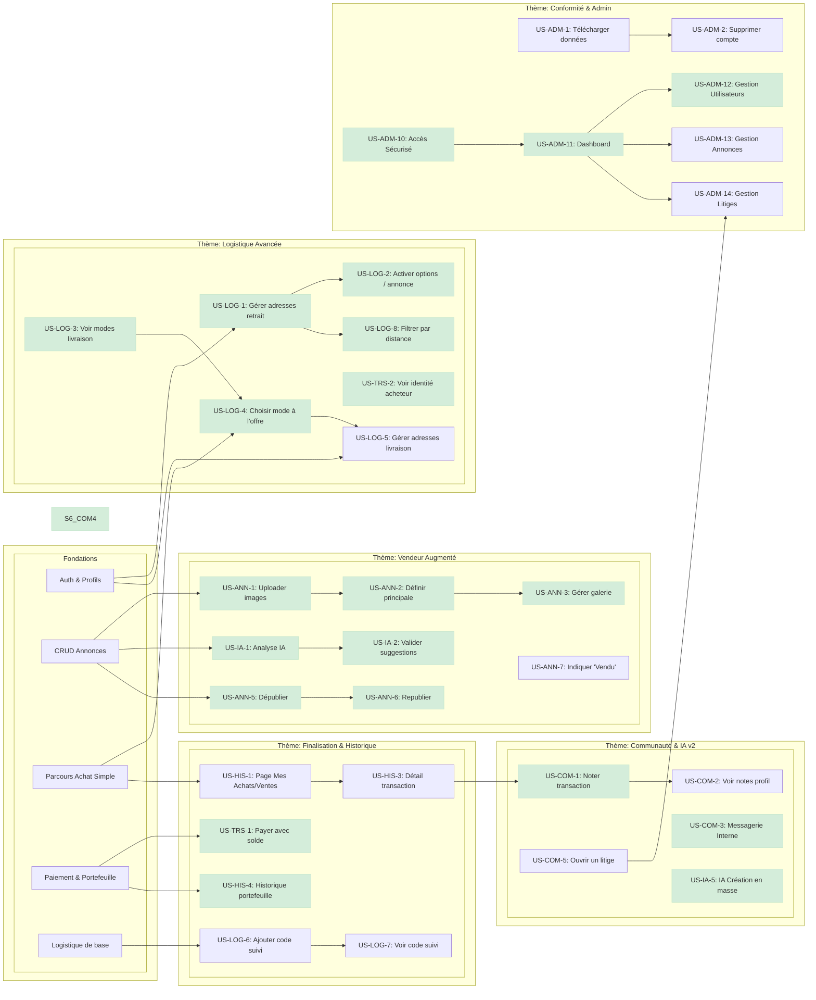

# Feuille de Route Stratégique du Projet Pifpaf

## 1. Introduction
Ce document présente la stratégie de développement du projet Pifpaf. L'objectif est de construire une marketplace de haute qualité de manière itérative.

Initialement organisé en **Sprints thématiques** séquentiels, le développement a évolué vers une approche plus organique, où les fonctionnalités ont été implémentées en fonction des opportunités et des dépendances techniques plutôt qu'un calendrier strict. **Ce document a été mis à jour pour refléter l'état actuel du projet.** Il sert désormais de carte globale des fonctionnalités (achevées et restantes) plutôt que d'un plan chronologique.

La priorisation et l'organisation des tâches sont basées sur un **arbre de dépendances technologiques** qui garantit que les fonctionnalités sont développées dans un ordre logique.

## 2. L'Arbre Technologique & Les Lignes de Développement
Notre stratégie est visualisée par l'arbre ci-dessous. Il montre les dépendances entre les fonctionnalités et leur état d'avancement. **Les fonctionnalités terminées sont sur fond vert.**

## 3. État d'Avancement par Thème

### ✔️ Thème 0-2 : Fondations (Terminé)
- **Statut :** Un socle fonctionnel permettant de s'inscrire, de créer une annonce simple, de l'acheter avec un système de paiement et de portefeuille simulé.

### 🗺️ Thème 3 : Vendeur Augmenté (Partiellement Terminé)
- **Statut :** La majorité des fonctionnalités sont implémentées (galerie d'images, IA MVP, gestion du catalogue).
- **Restant :** `US-ANN-7` (Indiquer qu'un article est vendu sur sa page de détail).

### 🗺️ Thème 4 : Logistique Avancée (Partiellement Terminé)
- **Statut :** Le parcours de configuration vendeur et de sélection par l'acheteur est presque complet. La recherche par distance est fonctionnelle.
- **Restant :** `US-LOG-5` (Créer l'interface de gestion des adresses de livraison pour l'acheteur).

### 🗺️ Thème 5 : Finalisation & Historique (Partiellement Terminé)
- **Statut :** Le paiement par portefeuille et son historique sont fonctionnels.
- **Restant :** `US-LOG-6` & `US-LOG-7` (Gestion du suivi de colis), `US-HIS-1` & `US-HIS-3` (Historique détaillé des transactions).

### 🗺️ Thème 6 : Communauté & IA v2 (Partiellement Terminé)
- **Statut :** La messagerie interne, le système de notation initial et l'IA multi-objets sont implémentés.
- **Restant :** `US-COM-2` (Affichage des notes sur le profil), `US-COM-5` (Gestion des litiges).

### 🗺️ Thème 7 : Conformité (Non commencé)
- **Statut :** Les fonctionnalités liées au RGPD n'ont pas encore été implémentées.
- **Restant :** `US-ADM-1` (Export des données), `US-ADM-2` (Suppression de compte).

### 🗺️ Thème 8 : Administration & Modération (Partiellement Terminé)
- **Statut :** Le socle de l'interface d'administration est en place (accès, dashboard, gestion utilisateurs).
- **Restant :** `US-ADM-13` (Gestion des annonces), `US-ADM-14` (Gestion des litiges).
