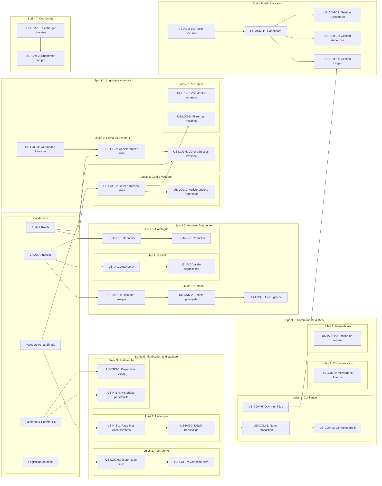

# Feuille de Route Stratégique du Projet Pifpaf

## 1. Introduction
Ce document présente la stratégie de développement du projet Pifpaf. L'objectif est de construire une marketplace de haute qualité de manière itérative, en organisant le travail autour de **Sprints thématiques** conçus pour un développement parallèle par **trois agents IA (Jules 1, Jules 2, Jules 3)**.

La priorisation et l'organisation des tâches sont basées sur un **arbre de dépendances technologiques** qui garantit que les fonctionnalités sont développées dans un ordre logique, tout en maximisant le travail simultané.

## 2. L'Arbre Technologique & Les Lignes de Développement
Notre stratégie est visualisée par l'arbre ci-dessous. Il montre les dépendances entre les fonctionnalités et comment elles sont réparties entre les trois agents à travers les Sprints.

## 3. Déroulement des Sprints

### ✔️ Sprints 0-2 : Fondations (Terminé)
- **Objectif Atteint :** Un socle fonctionnel permettant de s'inscrire, de créer une annonce simple, de l'acheter avec un système de paiement et de portefeuille simulé.

### 🚀 Sprint 3 : Vendeur Augmenté
- **Objectif :** Enrichir l'expérience du vendeur avec des outils plus puissants.
- **Lignes de Développement :**
  - **Jules 1 :** Implémentation de la galerie d'images multi-upload.
  - **Jules 2 :** Mise en place du MVP de l'IA pour la création d'annonce.
  - **Jules 3 :** Ajout des fonctionnalités de dépublication/republication.
- **Point de Synchronisation :** À la fin du sprint, un vendeur peut créer une annonce enrichie (plusieurs images), assistée par IA, et la gérer plus finement.

### 🚀 Sprint 4 : Logistique Avancée
- **Objectif :** Mettre en place un système de livraison et de retrait sur place complet.
- **Lignes de Développement :**
  - **Jules 1 :** Développement du back-office vendeur pour configurer ses options.
  - **Jules 2 :** Intégration de ces options dans le parcours d'achat.
  - **Jules 3 :** Amélioration de la transparence et de la recherche (identité, distance).
- **Point de Synchronisation :** Une transaction peut désormais inclure une option de logistique claire, choisie par l'acheteur et configurée par le vendeur.

### 🚀 Sprint 5 : Finalisation & Historique
- **Objectif :** Apporter de la visibilité post-transaction et enrichir le portefeuille.
- **Lignes de Développement :**
  - **Jules 1 :** Implémentation du suivi de colis.
  - **Jules 2 :** Création des pages d'historique des transactions.
  - **Jules 3 :** Intégration du paiement par portefeuille et de son historique.
- **Point de Synchronisation :** L'utilisateur a une vue complète de ses transactions passées, présentes et futures.

### 🚀 Sprint 6 : Communauté & IA de Masse
- **Objectif :** Construire la confiance et la communication, et préparer l'IA à la montée en charge.
- **Lignes de Développement :**
  - **Jules 1 :** Mise en place du système de notation et de litiges.
  - **Jules 2 :** Création de la messagerie interne.
  - **Jules 3 :** Développement de la fonctionnalité IA de création en masse.
- **Point de Synchronisation :** La plateforme devient plus sociale, sécurisée et puissante.

### 🚀 Sprint 7 : Conformité
- **Objectif :** Assurer la conformité avec le RGPD.
- **Lignes de Développement :**
  - **Jules 1 & 2 :** Travail conjoint sur les fonctionnalités de portabilité et de suppression des données.
- **Point de Synchronisation :** Le projet atteint sa maturité en termes de respect des données utilisateur.

### 🚀 Sprint 8 : Administration & Modération
- **Objectif :** Fournir à l'équipe les outils internes pour gérer la plateforme.
- **Lignes de Développement :**
  - **Jules 1, 2 & 3 :** Développement conjoint de l'interface d'administration, du dashboard, et des modules de gestion (utilisateurs, annonces, litiges).
- **Point de Synchronisation :** La plateforme est entièrement administrable, garantissant sa pérennité et sa sécurité.
