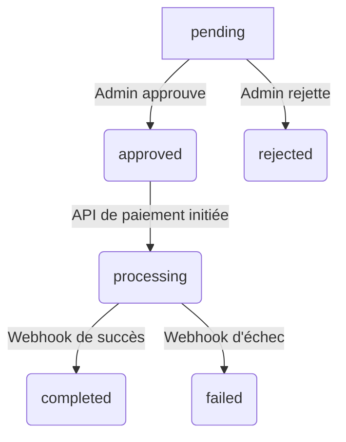

# Fiche Technique : Cycle de Vie d'un Virement (Withdrawal)

## 1. Vue d'ensemble

Ce document décrit l'architecture technique et le flux de données pour la fonctionnalité de demande de virement, qui permet aux utilisateurs de transférer les fonds de leur portefeuille PifPaf vers leur compte bancaire personnel.

Le processus actuel, qui consiste en une simple soustraction de la colonne `wallet` de l'utilisateur, est inadéquat et sera remplacé par un système robuste basé sur des états, avec une nouvelle table `withdrawals` pour suivre chaque demande. Ce système s'intégrera à un service de paiement externe (ex: Stripe) pour gérer les transferts de fonds réels.

## 2. Modèle de Données

### Nouvelle Table : `withdrawals`

Une nouvelle table `withdrawals` sera créée pour stocker et suivre chaque demande de virement.

- **`id`** (UUID, Clé primaire)
- **`user_id`** (Clé étrangère vers `users.id`) : L'utilisateur qui fait la demande.
- **`amount`** (Decimal) : Le montant du virement demandé.
- **`status`** (Enum) : Le statut actuel de la demande. Voir le diagramme d'état ci-dessous.
- **`processed_at`** (Timestamp, nullable) : La date à laquelle la demande a été approuvée et envoyée au traitement.
- **`completed_at`** (Timestamp, nullable) : La date à laquelle le virement a été confirmé comme terminé.
- **`failed_reason`** (Text, nullable) : La raison de l'échec, si applicable (ex: retour de l'API de paiement).
- **`admin_notes`** (Text, nullable) : Notes internes ajoutées par un administrateur (ex: raison d'un rejet manuel).
- **`payment_provider_id`** (String, nullable) : L'ID de la transaction de virement du côté du fournisseur de paiement.
- **`created_at`**, **`updated_at`** (Timestamps)

### Modifications sur la table `users`

- **`wallet`** (Decimal) : Le solde total du portefeuille.
- **`frozen_wallet_balance`** (Decimal, default: 0) : Une nouvelle colonne sera ajoutée pour suivre les fonds qui sont "gelés" car ils font l'objet d'une demande de virement en attente. Le **solde disponible** pour l'utilisateur sera calculé comme `wallet - frozen_wallet_balance`.

## 3. Diagramme d'État du Virement

Le cycle de vie d'une demande de virement suivra les états suivants :

- **`pending`** : La demande a été créée par l'utilisateur et est en attente de validation par un administrateur. Le montant est gelé.
- **`approved`** : La demande a été approuvée par un administrateur. Le système va initier le transfert.
- **`rejected`** : La demande a été rejetée manuellement par un administrateur. Les fonds gelés sont restitués à l'utilisateur.
- **`processing`** : Le virement a été initié auprès du service de paiement. En attente de confirmation.
- **`completed`** : Le service de paiement a confirmé que le virement a été effectué avec succès. Le montant est définitivement débité du portefeuille de l'utilisateur et les fonds gelés sont libérés.
- **`failed`** : Le service de paiement a signalé un échec. Les fonds gelés sont restitués au portefeuille de l'utilisateur.

## 4. Flux du Processus Détaillé

1.  **Création de la demande :**
    - L'utilisateur soumet une demande de virement via un formulaire.
    - Le contrôleur (`WithdrawalController@store`) valide que le montant demandé est inférieur ou égal au solde disponible (`user.wallet - user.frozen_wallet_balance`).
    - Une nouvelle entrée est créée dans la table `withdrawals` avec le statut `pending`.
    - Le montant de la demande est ajouté à `user.frozen_wallet_balance`.
    - `user.save()` est appelé.

2.  **Validation par l'Admin :**
    - Un administrateur consulte la liste des demandes `pending` dans un tableau de bord.
    - **Si l'admin approuve :**
        - Le statut de la demande passe à `approved`.
        - Un job (ex: `ProcessWithdrawalJob`) est dispatché pour communiquer avec le service de paiement.
    - **Si l'admin rejette :**
        - Le statut de la demande passe à `rejected`.
        - Le montant de la demande est soustrait de `user.frozen_wallet_balance`.
        - L'utilisateur est notifié.

3.  **Traitement et Finalisation (via le Job et les Webhooks) :**
    - Le `ProcessWithdrawalJob` envoie la demande de virement à l'API de Stripe (ou autre).
    - Le statut de la demande passe à `processing`.
    - Le système attend un webhook de Stripe pour la confirmation.
    - **Webhook de Succès (`payout.paid`) :**
        - Le statut de la demande passe à `completed`.
        - Le montant est soustrait de `user.wallet` **ET** de `user.frozen_wallet_balance`.
        - L'utilisateur est notifié.
    - **Webhook d'Échec (`payout.failed`) :**
        - Le statut de la demande passe à `failed`.
        - La raison de l'échec est enregistrée dans `failed_reason`.
        - Le montant est soustrait de `user.frozen_wallet_balance` (mais **pas** de `user.wallet`).
        - L'utilisateur est notifié.

## 5. Intégration avec les Services Externes

- **Stripe Connect :** Pour une solution robuste et conforme, Stripe Connect sera utilisé. Les utilisateurs connecteront leur compte PifPaf à un compte Stripe Express, où ils fourniront leurs informations bancaires directement à Stripe. PifPaf n'aura jamais besoin de stocker d'IBAN ou d'autres données bancaires sensibles.
- **Webhooks :** Un endpoint dédié (`/webhooks/stripe`) sera créé pour recevoir et traiter les événements de Stripe de manière asynchrone, assurant la mise à jour des statuts des virements.

## 6. Sécurité

- Aucune information bancaire sensible ne sera stockée dans la base de données de PifPaf. Cette responsabilité sera déléguée à Stripe.
- Toutes les opérations modifiant les soldes (`wallet`, `frozen_wallet_balance`) devront être effectuées à l'intérieur de transactions de base de données pour garantir l'atomicité et éviter les incohérences.
- L'accès à la gestion des virements sera protégé par un middleware d'administration.
