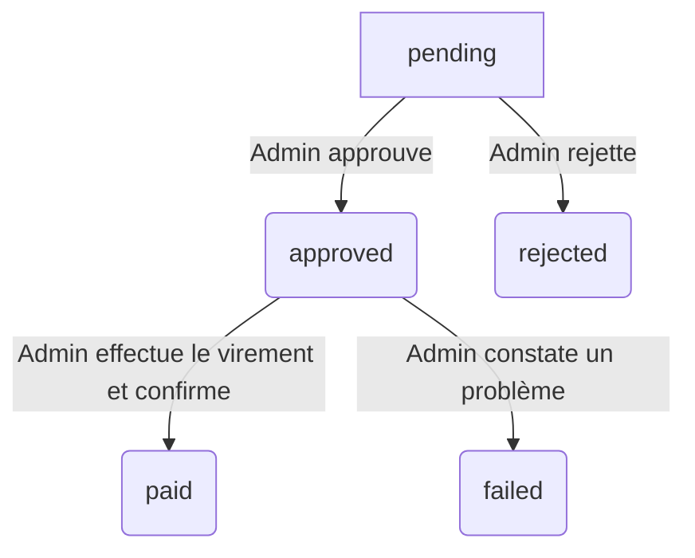

# Fiche Technique : Cycle de Vie d'un Virement (Withdrawal)

## 1. Vue d'ensemble

Ce document décrit l'architecture technique et le flux de données pour la fonctionnalité de demande de virement. Initialement envisagé comme un processus automatisé via une API, le système sera implémenté dans un premier temps comme un **processus manuel géré par un administrateur** pour garantir une traçabilité et une sécurité maximales.

Un administrateur examinera chaque demande, effectuera le virement bancaire en dehors de la plateforme, puis mettra à jour le statut de la demande dans le back-office pour refléter le paiement. Ce système est basé sur une nouvelle table `withdrawals` pour suivre chaque demande de manière rigoureuse.

## 2. Modèle de Données

### Nouvelle Table : `withdrawals`

Une nouvelle table `withdrawals` sera créée pour stocker et suivre chaque demande de virement.

- **`id`** (UUID, Clé primaire)
- **`user_id`** (Clé étrangère vers `users.id`) : L'utilisateur qui fait la demande.
- **`amount`** (Decimal) : Le montant du virement demandé.
- **`status`** (Enum) : Le statut actuel de la demande. Voir le diagramme d'état ci-dessous.
- **`approved_at`** (Timestamp, nullable) : La date à laquelle la demande a été approuvée par un admin.
- **`paid_at`** (Timestamp, nullable) : La date à laquelle l'admin a marqué le virement comme payé.
- **`failed_reason`** (Text, nullable) : La raison de l'échec, si applicable (ex: informations bancaires incorrectes).
- **`admin_notes`** (Text, nullable) : Notes internes ajoutées par un administrateur.
- **`created_at`**, **`updated_at`** (Timestamps)

### Modifications sur la table `users`

- **`wallet`** (Decimal) : Le solde total du portefeuille.
- **`frozen_wallet_balance`** (Decimal, default: 0) : Une nouvelle colonne sera ajoutée pour suivre les fonds qui sont "gelés" car ils font l'objet d'une demande de virement en attente. Le **solde disponible** pour l'utilisateur sera calculé comme `wallet - frozen_wallet_balance`.

## 3. Diagramme d'État du Virement

Le cycle de vie d'une demande de virement suivra les états suivants, gérés manuellement par un administrateur :

- **`pending`** : La demande a été créée par l'utilisateur et est en attente de validation par un administrateur. Le montant est gelé.
- **`approved`** : La demande a été approuvée par un administrateur et est en attente d'exécution manuelle du virement.
- **`rejected`** : La demande a été rejetée manuellement par un administrateur. Les fonds gelés sont restitués à l'utilisateur.
- **`paid`** : L'administrateur a effectué le virement manuellement et a marqué la demande comme "payée". Le montant est définitivement débité du portefeuille de l'utilisateur et les fonds gelés sont libérés.
- **`failed`** : L'administrateur n'a pas pu effectuer le virement (ex: IBAN incorrect). Les fonds gelés sont restitués au portefeuille de l'utilisateur.

## 4. Flux du Processus Détaillé

1.  **Création de la demande :**
    - L'utilisateur soumet une demande de virement via un formulaire, après avoir renseigné ses informations bancaires.
    - Le contrôleur (`WithdrawalController@store`) valide que le montant demandé est inférieur ou égal au solde disponible (`user.wallet - user.frozen_wallet_balance`).
    - Une nouvelle entrée est créée dans la table `withdrawals` avec le statut `pending`.
    - Le montant de la demande est ajouté à `user.frozen_wallet_balance`.
    - `user.save()` est appelé.

2.  **Validation par l'Admin :**
    - Un administrateur consulte la liste des demandes `pending` dans un tableau de bord.
    - **Si l'admin approuve :**
        - Le statut de la demande passe à `approved`.
        - L'administrateur est notifié que la demande est prête à être traitée.
    - **Si l'admin rejette :**
        - Le statut de la demande passe à `rejected`.
        - Le montant de la demande est soustrait de `user.frozen_wallet_balance`.
        - L'utilisateur est notifié.

3.  **Traitement Manuel et Finalisation :**
    - L'administrateur consulte la liste des virements avec le statut `approved`.
    - Il effectue le virement bancaire via l'interface de la banque de la plateforme.
    - Une fois le virement exécuté, l'administrateur retourne sur le back-office PifPaf.
    - **Si le virement a réussi :**
        - Il marque la demande comme **`paid`**.
        - Le montant est soustrait de `user.wallet` **ET** de `user.frozen_wallet_balance`.
        - L'utilisateur est notifié du succès.
    - **Si le virement a échoué :**
        - Il marque la demande comme **`failed`**.
        - Il ajoute une note dans `failed_reason`.
        - Le montant est soustrait de `user.frozen_wallet_balance` (mais **pas** de `user.wallet`).
        - L'utilisateur est notifié de l'échec.

## 5. Intégration avec les Services Externes

- Pour cette première version, il n'y aura **aucune intégration directe** avec une API bancaire pour l'exécution des virements.
- Le processus est entièrement basé sur une action manuelle de l'administrateur, garantissant un contrôle total sur les fonds sortants.

## 6. Sécurité

- Les informations bancaires des utilisateurs (IBAN) devront être stockées de manière sécurisée, avec un chiffrement au niveau de la base de données.
- Toutes les opérations modifiant les soldes (`wallet`, `frozen_wallet_balance`) devront être effectuées à l'intérieur de transactions de base de données pour garantir l'atomicité et éviter les incohérences.
- L'accès à la gestion des virements sera protégé par un middleware d'administration.
