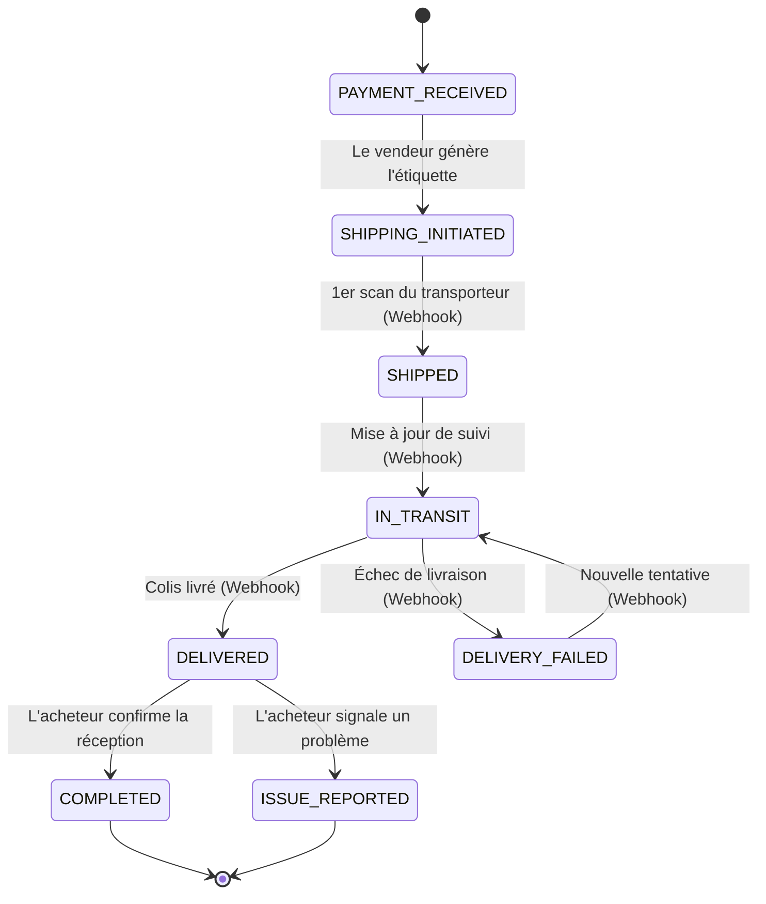

# Fiche Technique : Cycle de vie d'une Livraison (Sendcloud)

**Version:** 1.0
**Date:** 2025-11-08

## 1. Vue d'ensemble

Ce document décrit le cycle de vie complet d'une livraison, depuis sa création par le vendeur jusqu'à la confirmation de réception par l'acheteur. Le processus est orchestré par notre système et s'appuie sur l'API et les webhooks de Sendcloud pour le suivi des colis.

Le cycle de vie est conçu pour être robuste, transparent et fournir une communication claire à la fois pour le vendeur et l'acheteur à chaque étape clé.

## 2. Acteurs

*   **Vendeur:** L'utilisateur qui vend et expédie l'article.
*   **Acheteur:** L'utilisateur qui achète et reçoit l'article.
*   **Système Pifpaf:** Notre application Laravel, qui sert d'intermédiaire.
*   **Sendcloud:** Le service tiers qui gère la création des étiquettes et le suivi des colis.
*   **Transporteur:** L'entreprise de logistique qui effectue la livraison physique (ex: Colissimo, Mondial Relay).

## 3. Statuts de la Transaction

Pour refléter fidèlement le processus de livraison, les statuts suivants sont utilisés dans le modèle `Transaction` (`TransactionStatus` Enum) :

*   `PAYMENT_RECEIVED`: Le paiement a été accepté, en attente de l'expédition par le vendeur. (Statut pré-livraison)
*   `SHIPPING_INITIATED`: Le vendeur a généré l'étiquette d'expédition. Le système a créé le colis via l'API Sendcloud.
*   `SHIPPED`: Le colis a été scanné pour la première fois par le transporteur. Il est officiellement en cours d'acheminement.
*   `IN_TRANSIT`: Le colis est en transit entre les différents centres de tri du transporteur.
*   `DELIVERED`: Le transporteur a confirmé la livraison du colis à l'adresse de l'acheteur.
*   `DELIVERY_FAILED`: Une tentative de livraison a échoué.
*   `COMPLETED`: L'acheteur a confirmé manuellement la réception de l'article, finalisant la transaction. (Statut post-livraison)
*   `ISSUE_REPORTED`: L'acheteur a signalé un problème avec la commande. (Statut post-livraison)

## 4. Diagramme du Cycle de Vie (Mermaid)

## 5. Description des Phases

### Phase 1: Initiation de l'expédition (Action Vendeur)

*   **Déclencheur:** Le vendeur, depuis son tableau de bord des ventes, clique sur "Expédier l'article" pour une transaction au statut `PAYMENT_RECEIVED`.
*   **Processus Système:**
    1.  Le `TransactionController@ship` est appelé.
    2.  Le système vérifie que la transaction nécessite une expédition.
    3.  Le `SendcloudService@createParcel` est invoqué avec les détails de l'article (poids, dimensions) et l'adresse de livraison de l'acheteur.
    4.  Une requête `POST /parcels` est envoyée à l'API Sendcloud.
    5.  En cas de succès, Sendcloud retourne les données du colis, incluant `parcel_id`, `tracking_number` et `label_url`.
*   **Mise à jour BD:**
    *   La transaction est mise à jour avec :
        *   `status` = `SHIPPING_INITIATED`
        *   `sendcloud_parcel_id` = ID retourné par Sendcloud
        *   `tracking_code` = Numéro de suivi retourné
        *   `label_url` = URL de l'étiquette à imprimer
*   **Interface Utilisateur:**
    *   **Vendeur:** Une confirmation s'affiche avec un lien pour télécharger et imprimer l'étiquette d'expédition. Le statut de la commande sur son tableau de bord passe à "Envoi initié".
    *   **Acheteur:** Le statut de sa commande passe à "En préparation chez le vendeur".

### Phase 2: Expédition (Action Transporteur / Webhook Sendcloud)

*   **Déclencheur:** Le vendeur dépose le colis chez le transporteur, qui effectue le premier scan. Sendcloud reçoit cette information et envoie un webhook à notre système.
*   **Processus Système:**
    1.  Le `SendcloudWebhookController@handle` reçoit une notification.
    2.  La signature du webhook est vérifiée pour la sécurité.
    3.  Le payload JSON est analysé. L'action est `parcel_status_changed`.
    4.  Le système recherche la transaction correspondante via le `sendcloud_parcel_id`.
    5.  La méthode `mapStatus` fait correspondre le statut de Sendcloud (ex: `11` - En route) à notre statut interne `SHIPPED` ou `IN_TRANSIT`.
*   **Mise à jour BD:**
    *   Le `status` de la transaction est mis à jour (ex: `SHIPPED`).
*   **Interface Utilisateur:**
    *   **Vendeur & Acheteur:** Le statut de la commande est mis à jour en "Expédié". Le numéro de suivi devient cliquable et pointe vers la page de suivi du transporteur.

### Phase 3: En Transit (Webhook Sendcloud)

*   **Déclencheur:** Le colis passe par différentes étapes logistiques (centre de tri, etc.). À chaque étape significative, Sendcloud envoie un webhook.
*   **Processus Système:**
    *   Identique à la phase 2. Le `SendcloudWebhookController` met à jour le statut de la transaction en se basant sur la cartographie des statuts. Le statut principal reste `IN_TRANSIT`.
*   **Mise à jour BD:**
    *   Le `status` de la transaction passe à `IN_TRANSIT`.
*   **Interface Utilisateur:**
    *   **Vendeur & Acheteur:** Le statut de la commande affiche "En transit". L'historique de suivi détaillé pourrait être affiché si nous décidons de stocker tous les événements de suivi.

### Phase 4: Livraison (Webhook Sendcloud)

*   **Déclencheur:** Le transporteur confirme la livraison du colis. Sendcloud envoie un webhook.
*   **Processus Système:**
    1.  Le `SendcloudWebhookController` reçoit la notification.
    2.  Le `mapStatus` interprète le statut de Sendcloud (ex: `12` - Delivered) et le fait correspondre à notre statut `DELIVERED`.
*   **Mise à jour BD:**
    *   Le `status` de la transaction est mis à jour en `DELIVERED`.
*   **Interface Utilisateur:**
    *   **Vendeur:** Le statut de la commande passe à "Livré - En attente de confirmation".
    *   **Acheteur:** Le statut de la commande passe à "Livré". Un bouton "Confirmer la réception" devient visible sur la page de la commande. Le système envoie une notification e-mail/push à l'acheteur pour l'inviter à confirmer.

### Phase 5: Finalisation (Action Acheteur)

*   **Déclencheur:** L'acheteur clique sur "Confirmer la réception".
*   **Processus Système:**
    1.  Le `TransactionController@confirmReception` est appelé.
    2.  Le système vérifie que l'utilisateur est bien l'acheteur et que le statut est approprié (`DELIVERED`).
    3.  Le système transfère les fonds séquestrés vers le portefeuille du vendeur.
    4.  Un enregistrement est créé dans `WalletHistory`.
*   **Mise à jour BD:**
    *   Le `status` de la transaction passe à `COMPLETED`.
    *   Le `wallet` du vendeur est crédité.
*   **Interface Utilisateur:**
    *   **Vendeur:** La transaction est marquée comme "Terminée" et l'argent est visible dans son solde.
    *   **Acheteur:** La transaction est marquée comme "Terminée". Il est invité à laisser un avis sur le vendeur.

## 6. Cas d'Erreurs et Exceptions

*   **Échec de la création du colis:** Si l'API Sendcloud renvoie une erreur lors de la Phase 1, l'erreur est enregistrée, et un message "Erreur lors de la création de l'envoi, veuillez réessayer" est affiché au vendeur. Le statut de la transaction reste `PAYMENT_RECEIVED`.
*   **Webhook invalide:** Si la signature est invalide, la requête est rejetée avec un statut 403 pour des raisons de sécurité.
*   **Échec de livraison:** Si un webhook signale un `DELIVERY_FAILED`, le statut de la transaction est mis à jour en conséquence. Des notifications sont envoyées à l'acheteur et au vendeur pour les informer de la situation.
*   **Colis perdu/endommagé:** Un processus de support client doit être défini pour gérer ces cas, qui ne peuvent pas être entièrement automatisés.
